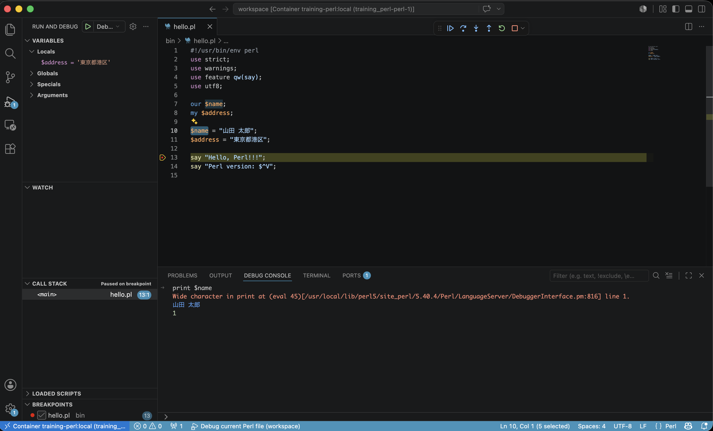

# training_perl_cgi

DockerコンテナのPerl練習用の環境です。
デバッガーを使ってステップ実行して入門しましょう。
Apache の CGI 方式で動くホーム画面も用意しています。
フロントのHTMLは `public/index.html`、CGIスクリプトは `public/index.cgi` です。

## 使い方

```sh
make build
make up
```

ブラウザで開く:

```txt
http://localhost:3000
```

## PostgreSQL 18

PostgreSQL 18 は Docker Compose の `db` サービスとして起動します。初回起動時に `db/schema.sql` が読み込まれ、登録フォーム用の `registrations` テーブルが作成されます。

接続設定の初期値:

```sh
DB_HOST=db
DB_PORT=5432
DB_NAME=training_perl
DB_USER=training_perl
DB_PASSWORD=training_perl
```

接続情報を変える場合は `.env.example` を参考に `.env` を作成してください。

シェルに入る場合:

```sh
make shell
```

コンテナを起動したままにする場合:

```sh
make up
docker compose exec perl bash
```

テスト:

```sh
make test
```

## VSCode でデバッグする

VSCode に Dev Containers 拡張が入っている状態で、このフォルダを開いてから `Dev Containers: Reopen in Container` を実行してください。

コンテナ内の VSCode には Perl 拡張 `richterger.perl` が入り、Docker イメージ側にはデバッグアダプタ兼 language server の `Perl::LanguageServer` が入ります。

デバッグは VSCode の Run and Debug から以下を選べます。

- `Debug CGI home`
- `Debug hello.pl`

CGIホーム画面を追うなら `Debug CGI home`、最初のステップ実行なら `Debug hello.pl` でブレークポイントを置いて実行できます。

CPAN モジュールを追加したい場合は `cpanfile` に書いてから、必要に応じて Dockerfile や起動後のコンテナでインストールしてください。

詳しい手順は [GETTING_STARTED.md](GETTING_STARTED.md) を見てください。



Enjoy!
